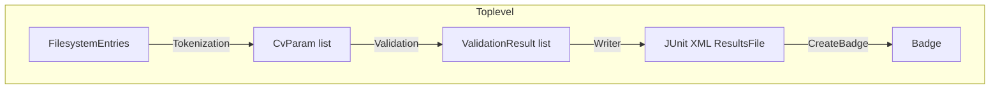
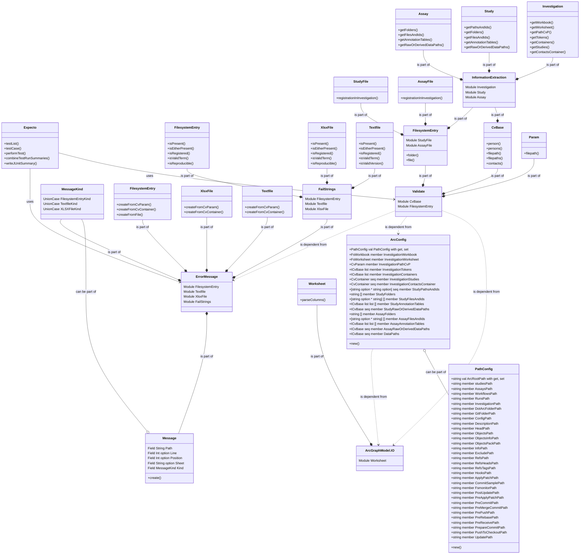
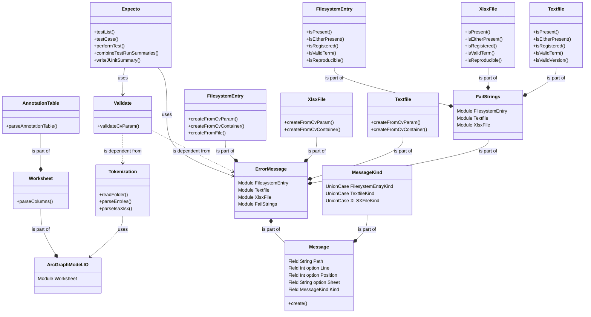

# arc-validate

⚠️ 🚧

arc-validate is undergoing a significant re-write. The main branch will only be patched with the absolute necessary hotfixes for production
to get up-to-date info on the development process, take a look at the [V2 branch](https://github.com/nfdi4plants/arc-validate/tree/V2)

⚠️ 🚧

Base repository to validate [ARCs](https://github.com/nfdi4plants/ARC-specification/blob/main/ARC%20specification.md).  
This repository provides containerized validation workflows for usage in [DataHUB](https://git.nfdi4plants.org/explore)-CI jobs.  
Uses [Expecto](https://github.com/haf/expecto) and [ArcGraphModel](https://github.com/nfdi4plants/ArcGraphModel) to run unit tests that test ARCs according to the ARC-specification and the [ISA.NET](https://github.com/nfdi4plants/ISADotNet) model.

## Workflow of the validation

The project executes several specified unit tests on a given path to an ARC folder and creates a JUnit summary file containing the test results. Afterwards runs a python script that reads the summary file and creates an SVG badge according to the test results.  
Tests are separated hierarchically into several test lists to tackle both ARC specification as well as ISA.NET standard.  
This structure is also depicted in the _testcase name_ in the summary file.

_Filesystem_ tests treat ARC specification-related requirements on ARCs regarding filesystem structure (i.e., the presence and content of specific files and folders) while _ISA_ tests cover both ARC specification as well as the ISA standard (in the form of ISA.NET requirements).

### Filesystem tests

_(WIP)_

### ISA tests

- **Schema**: Tests about the ISA schema format correctness. E.g.:
  - _Is there an investigation?_
- **Semantic**: Tests about semantic compliance to ARC specification. E.g.:
  - _Do all terms have identifiers?_
  - _Is the ARC CWL-compliant?_
- **Plausibility**: Tests about scientific plausibility. E.g.:
  - _Is there a Factor?_
  - _Does the ISA object make sense from a scientific point of view?_

### Test classification

Test are separated into critical and non-critical.  
Critical tests are such that concern the primal integrity of the ARC. If these fail, the ARC's integrity is not given and thus does not satisfy the requirements (i.e., the ARC specification) on a basic level.  
Non-Critical tests revolve around best practices in ARC and ISA structure and annotation and describe the quality of an ARC.  
If any critical test fails, the validation returns an error exit code while this does not happen if all critical tests succeed.  
This differentiation is important for, e.g., downstream applications and pipelines, using the output of the validation and behaving differently, according to the result of the validation.

### List of critical tests

- Is the `.arc` folder present?
- Are a `.git` folder and all related files and subfolders present?
- Is an Investigation file present?
- Does the investigation have an identifier?
- Does the Investigation have a title?
- Does at least one correctly registered person exist in the Investigation Contacts section?
- Does the ARC contain a top-level valid CWL (≥v1.2) file?
- Is the `studies` folder present?
- Does each Study in the `studies` folder have a Study file?
- Are all Studies present in the `studies` folder registered in the Investigation file?
- Do all Studies registered in the Investigation file have an identifier?
- Do all Studies registered in the Investigation file have a Study filepath?
- Are all Studies registered in the Investigation file present in the filesystem?
- Is the `assays` folder present?
- Does each Assay in the `assays` folder have an Assay file?
- Are all Assays present in the `assays` folder registered in the Investigation file and any Study file?
- Do all Assays registered in the Investigation file or any Study file have an identifier? 
- Do all Assays registered in the Investigation file or any Study file have an Assay filepath?
- Are all Assays registered in the Investigation file or any Study file present in the filesystem? 
- Is the `workflows` folder present?
- Does every Workflow contain a valid CWL (≥v1.2) file?
- Is the `runs` folder present?
- Does every Run contain a valid CWL (≥v1.2) file?
- Are all in the Annotation Tables described datafile paths present in the filesystem?

### List of non-critical tests

- Does any Study or Assay contain a Factor?
- Do all Annotation Tables have valid input (`Source Name`) and output (`Sample Name`, `Raw Data File`, `Derived Data File`) columns?
- Are all Annotation Table input and output columns filled out?
- Are all Annotation Table terms valid? (i.e., do they have valid TANs (Term Accession Numbers) and TSRs (Term Source REFs)?)
- Are community-specific data formats used? (i.e., mzML, mzTAB, fastq, fastq.gz, SAM, BAM)

## Structure

### Flow

### Modules (currently)

### Modules (planned)

## Requirements:

### Reader:

#### CvParam parsing – Filesystem:

Transformation of FilesystemEntries (gathered via System.IO functionality) into CvParams with file or folder values.

#### CvParam parsing – Metadata:

Metadata parsing according to ARC specification (ISA.XLSX files, CWL files)
  - Depending on the type of input (e.g. AnnotationTable, Investigation metadata section), the reader must parse the content respectively:
    - Parse metadata section in Assay/Study/Investigation: Search for sheet with respective name ("Study"/"Assay"/"isa_investigation") and parse the content of the row-based table (key-value pairs) into CvParams
    - Parse AnnotationTable in Assay/Study: Search for all tables containing "annotationTable" in their name and parse the content of the column-based table (key-value pairs) into CvParams

## Develop

If you'd like to contribute, please follow the following steps (basic knowledge about Docker is helpful but not required):

### Build tool locally

In repo root, run `build.cmd`.

### Test tool locally

In repo root, run `./src/arc-validate/bin/Release/net6.0/arc-validate.exe -p {PATH_TO_YOUR_ARC_FOLDER_HERE}`

### Build Docker container 

Start your Docker environment (e.g. Docker Desktop).  
In the repo root, run `docker build -t arc-validate .`

### How to look into the container

In repo root use `docker run -it arc-validate bash`.
Navigate to repo root inside the Docker container: `cd ../opt/arc-validate/`.

### Running ARC validation

The container will contain an `arc-validate.sh` script that will execute the test project:

- Execute `arc-validate.sh` 
- The test project will look for ARC-related files and folders in {$ARC_PATH} and run several test on them to validate the ARC
- The test results are then written to `{$ARC_PATH}/arc-validate-results.xml` (in the container)

So there are 2 easy ways to use the container:
1. Mount a local ARC into the container and run `arc-validate.sh`, e.g.: `docker run -d --mount type=bind,source={PATH_TO_YOUR_ARC_FOLDER_HERE},target=/arc arc-validate arc-validate.sh`  
-or-
2. Use it as a base image and use `arc-validate.sh` directly.

### Creating the badge

The container will contain a `create-badge.py` script that will create the arc quality badge:

- The script will parse `arc-validate-results.xml` in {$ARC_PATH}
- The script will create a badge displaying passed/failed tests in the working directory as `{$ARC_PATH}/arc-quality.svg`, e.g: 
- *Note:* Currently, tests that ***error*** (in contrast to tests that ***fail***) are **ignored for calculation**.

So there are 2 easy ways to use the script in the container:
1. Mount a local directory with `arc-validate-results.xml` (e.g. after runnning `arc-validate.sh` as specified above) into the container and run `create-badge.py`, e.g.: `docker run -d --mount type=bind,source={PATH_TO_YOUR_ARC_FOLDER_HERE},target=/arc arc-validate create-badge.py`  
-or-
2. Use it as a base image and use `create-badge.py` directly.
