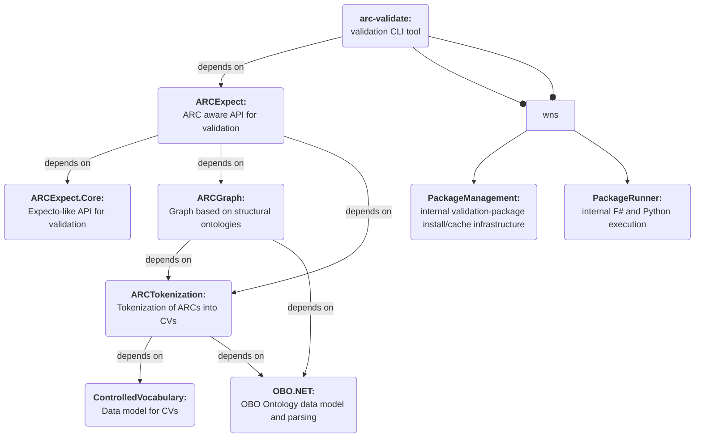

# arc-validate

Home of all the tools and libraries to create and run validation of ARCs:

- **ARCExpect** ([docs :notebook:](https://nfdi4plants.github.io/arc-validate/ARCExpect/introduction.html)) - easy to use and understand APIs to create and execute validation cases.
- **arc-validate/** ([docs :notebook:](https://nfdi4plants.github.io/arc-validate/arc-validate/introduction.html)) - CLI tool that offers commands for validating ARCs and managing validation packages.

## Docker container

This repository provides a [docker container](https://github.com/nfdi4plants/arc-validate/pkgs/container/arc-validate) that has the `arc-validate` tool pre-installed for using it in [DataHUB](https://git.nfdi4plants.org/explore)-CI jobs.

Use the containers tagged with [main](https://github.com/nfdi4plants/arc-validate/pkgs/container/arc-validate/174978018?tag=main) for production use.

## Project aim

Validation of ARCs based on:
- **ARCTokenization**: Structural ontologies for file formats (for parsing/tokenizing files): INVMSO, STDMSO, ASSMSO
- **OBO.NET**:
    - parsing ontologies, generation of **OBO graphs** based on ontology term relation
    - code genearation of ontology modules with accessible terms
- **ARCGraph**: Graph representation of file content based on structural ontologies via **OBO graph**
- **Graph-based** completion of File content (missing cells -> empty tokens) via **ARCGraph**
- **ARCExpect.Core**: Expecto-like API for validation
- **ARCExpect**: ARC aware API for validation cases
- **Validation Packages**: API for installing and executing additional validation packages

## Project layout

### Dependency visualization


```mermaid
flowchart TD

ControlledVocabulary("<b>ControlledVocabulary:</b><br>Data model for CVs")
ARCTokenization("<b>ARCTokenization:</b><br>Tokenization of ARCs into CVs")
OBO.NET("<b>OBO.NET:</b><br>OBO Ontology data model and parsing")
ARCGraph("<b>ARCGraph:</b><br>Graph based on structural ontologies")
ARCExpect("<b>ARCExpect:</b><br>ARC aware API for validation")
ARCExpect.Core("<b>ARCExpect.Core:</b><br>Expecto-like API for validation")
PackageManagement("<b>PackageManagement:</b><br>internal validation-package install/cache infrastructure")
PackageRunner("<b>PackageRunner:</b><br>internal F# and Python execution")
arc-validate("<b>arc-validate:</b><br>validation CLI tool")

arc-validate --depends on--> ARCExpect
arc-validate --owns--> PackageManagement
arc-validate --owns--> PackageRunner
ARCTokenization --depends on--> ControlledVocabulary
ARCTokenization --depends on--> OBO.NET
ARCExpect --depends on--> ARCExpect.Core
ARCExpect --depends on--> ARCGraph
ARCExpect --depends on--> ARCTokenization
ARCGraph --depends on--> ARCTokenization
ARCGraph --depends on--> OBO.NET
```

### Libraries used

#### ARCExpect

- [ARCTokenization](https://github.com/nfdi4plants/ARCTokenization)
- [ValidationPackage.Model](https://github.com/nfdi4plants/arc-validate-package-registry)
- [ValidationPackage.Codecs](https://github.com/nfdi4plants/arc-validate-package-registry)
- [OBO.NET](https://github.com/CSBiology/OBO.NET)
- [Graphoscope](https://github.com/fslaborg/Graphoscope)
- [Cytoscape.NET](https://github.com/fslaborg/Cytoscape.NET)
- [FSharpAux](https://github.com/CSBiology/FSharpAux)
- [FsSpreadsheet](https://github.com/fslaborg/FsSpreadsheet)
- [Expecto](https://github.com/haf/expecto)

#### arc-validate

- ARCExpect
- [AVPRClient](https://github.com/nfdi4plants/arc-validate-package-registry)
- [AVPRClient.Interop](https://github.com/nfdi4plants/arc-validate-package-registry)
- ValidationPackage.Model
- [Argu](https://github.com/fsprojects/Argu)
- [Expecto](https://github.com/haf/expecto)
- [Spectre.Console](https://github.com/spectreconsole/spectre.console)


## Development

For how to contribute to and how to develop on this project, please read the [Contributing guidelines](https://github.com/nfdi4plants/arc-validate/blob/release/CONTRIBUTING.md).


Just call `build.sh` or `build.cmd` depending on your OS.

### Test

test setup uses the AVPR development service, running tests for the compiled `arc-validate` tool with validation packages from https://avpr-dev.nfdi4plants.org. Network-backed tests must not target the production registry.

since testing the cli tool relies on it being compiled via `dotnet publish`, either use the build scripts or manually publish `arc-validate` to the `/publish` folder when using e.g. TestExplorers.

```bash
build.sh runtests
```

```bash
build.cmd runtests
```

### Create NuGet packages

```bash
build.sh pack
```
