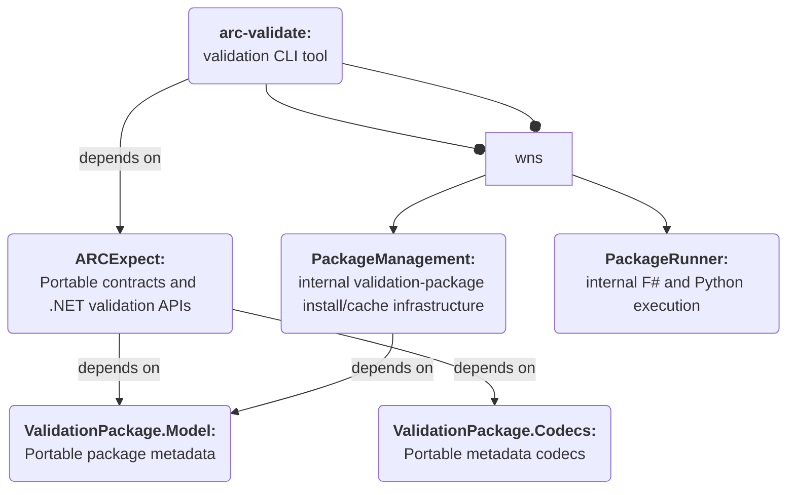

# arc-validate

Home of all the tools and libraries to create and run validation of ARCs:

- **ARCExpect** ([polyglot guide](https://nfdi4plants.github.io/arc-validate/ARCExpect/simple-validation-package/)) - portable APIs to create and execute validation packages.
- **arc-validate** ([CLI guide](https://nfdi4plants.github.io/arc-validate/arc-validate/introduction/)) - commands for validating ARCs and managing validation packages.

## Docker container

This repository provides a [docker container](https://github.com/nfdi4plants/arc-validate/pkgs/container/arc-validate) that has the `arc-validate` tool pre-installed for using it in [DataHUB](https://git.nfdi4plants.org/explore)-CI jobs.

Use the containers tagged with [main](https://github.com/nfdi4plants/arc-validate/pkgs/container/arc-validate/174978018?tag=main) for production use.

## Project aim

Validation of ARCs is based on:

- **ARCExpect**: portable Pyxpecto package execution, result, summary, JUnit,
  and badge APIs for .NET, JavaScript, and Python, plus target-specific output
  writing on .NET and Python and .NET-only ARCTokenization and
  ControlledVocabulary helpers.
- **Validation packages**: installable F# and Python validation scripts with
  shared metadata contracts from AVPR.
- **arc-validate**: package management, execution, and CLI orchestration.

## Project layout

### Dependency visualization


```mermaid
flowchart TD

ValidationPackageModel("<b>ValidationPackage.Model:</b><br>Portable package metadata")
ValidationPackageCodecs("<b>ValidationPackage.Codecs:</b><br>Portable metadata codecs")
ARCExpect("<b>ARCExpect:</b><br>Portable contracts and .NET validation APIs")
PackageManagement("<b>PackageManagement:</b><br>internal validation-package install/cache infrastructure")
PackageRunner("<b>PackageRunner:</b><br>internal F# and Python execution")
arc-validate("<b>arc-validate:</b><br>validation CLI tool")

arc-validate --depends on--> ARCExpect
arc-validate --owns--> PackageManagement
arc-validate --owns--> PackageRunner
ARCExpect --depends on--> ValidationPackageModel
ARCExpect --depends on--> ValidationPackageCodecs
PackageManagement --depends on--> ValidationPackageModel
```

### Recording source provenance

Validation output can optionally record the branch and commit that supplied
the validated ARC:

```bash
arc-validate validate \
  --source-branch "$CI_COMMIT_REF_NAME" \
  --source-commit-hash "$CI_COMMIT_SHA"
```

Both options are independent and optional. When present, arc-validate writes
them to `validation_summary.json`, standard JUnit `<properties>`, and
non-rendered SVG `<metadata>`. When absent, those fields and elements are
omitted. Package-based validation receives the same switches in the package
process argument list; ARCExpect's .NET and Python validation pipelines consume
them automatically.

See the [arc-validate argument documentation](docs/arc-validate/introduction.md#validation-package-arguments)
for the complete distinction between CLI-only and package-process arguments.
Package-defined arguments follow the first `--` and are parsed by ARCExpect
against the package's CWL `Inputs` metadata:

```bash
arc-validate validate -p example -i ./arc -- --test --echo "literal value"
```

arc-validate and its script runners preserve every value as a separate process
argument; they do not construct or evaluate shell commands.

### Libraries used

#### ARCExpect

- [ARCTokenization](https://github.com/nfdi4plants/ARCTokenization)
- [ValidationPackage.Model](https://github.com/nfdi4plants/arc-validate-package-registry)
- [ValidationPackage.Codecs](https://github.com/nfdi4plants/arc-validate-package-registry)
- [Fable](https://fable.io/)
- [Fable.Pyxpecto](https://github.com/Freymaurer/Fable.Pyxpecto)
- [Thoth.Json](https://github.com/thoth-org/Thoth.Json)

#### arc-validate

- ARCExpect
- [AVPRClient](https://github.com/nfdi4plants/arc-validate-package-registry)
- [AVPRClient.Interop](https://github.com/nfdi4plants/arc-validate-package-registry)
- ValidationPackage.Model
- [Argu](https://github.com/fsprojects/Argu)
- [Expecto](https://github.com/haf/expecto)
- [Spectre.Console](https://github.com/spectreconsole/spectre.console)


## Development

For how to contribute to and how to develop on this project, please read the [Contributing guidelines](https://github.com/nfdi4plants/arc-validate/blob/release/CONTRIBUTING.md).


Just call `build.sh` or `build.cmd` depending on your OS.

### Documentation

The documentation site combines a MkDocs Material guide with an fsdocs API
reference. Every available F# and Python validation-package example is a real
program under `docs/samples/`; the guide includes those files verbatim and the
build installs and runs them against freshly packed artifacts. Each verification
pass also regenerates the checked-in JSON summary, JUnit report, and SVG badge
shown beside the sample. JavaScript package examples remain marked “Coming
soon” until that package format exists.

```shell
./build.sh RunDocsSamples # pack and execute every language sample
./build.sh BuildDocs      # build the guide and API reference into site/
./build.sh WatchDocs      # preview the MkDocs guide with live reload
./build.sh WatchApiDocs   # preview the generated F# API reference
```

Use the corresponding `build.cmd` commands on Windows.

### Test

The full test setup uses the AVPR development service, running tests for the
compiled `arc-validate` tool with validation packages from
https://avpr-dev.nfdi4plants.org. Network-backed tests must not target the
production registry. `RunTests` remains the default full suite. Push and
pull-request CI uses `RunAutomatedTests`, which excludes the live `integration`
groups; run the manually dispatched `Full tests with AVPR integration` workflow
to execute the full suite in CI.

since testing the cli tool relies on it being compiled via `dotnet publish`, either use the build scripts or manually publish `arc-validate` to the `/publish` folder when using e.g. TestExplorers.

```bash
build.sh RunTests
```

```bash
build.cmd RunTests
```

### Build and release ARCExpect packages

To build and verify the three ARCExpect artifacts (`ARCExpect` for NuGet,
`@nfdi4plants/arcexpect` for npm, and `arcexpect` for Python), run:

```bash
build.cmd TestPortableARCExpect
```

`PackARCExpect` creates the three artifacts without publishing them. Reviewed
releases use the manually dispatched `Release ARCExpect` workflow against the
`release` branch. It verifies the core and portable suites, packs once, and
publishes independent NuGet, npm, and PyPI jobs through the protected `release`
environment. See [the release guide](docs/development/releases.md) for
versioning and the exact trusted-publisher configuration.
