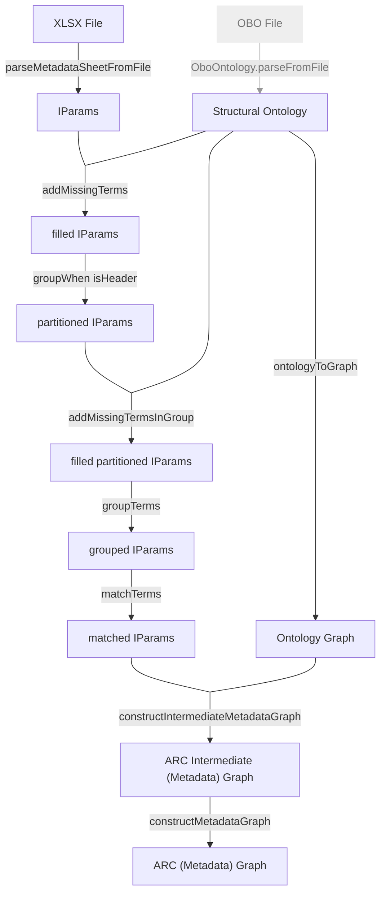

```mermaid

flowchart 
	xf[XLSX File]
	ips[IParams]
	of[OBO File]
	fips[filled IParams]
	partiparams[partitioned IParams]
	fipartips[filled partitioned IParams]
	grips[grouped IParams]
	onto[Structural Ontology]
	og[Ontology Graph]
	maps[matched IParams]
	arcigr["ARC Intermediate (Metadata) Graph"]
	arcgr["ARC (Metadata) Graph"]

	D[ ]
	D2[ ]
	D3[ ]

	style D height:0.0000001px,width:0.000001px
	style D2 height:0.0000001px,width:0.000001px
	style D3 height:0.0000001px,width:0.000001px
	style of fill:#EEE,stroke-width:0,color:#777

	xf --> |parseMetadataSheetFromFile| ips
	of --> |OboOntology.parseFromFile| onto
	ips & onto --- D
	D --> |addMissingTerms| fips
	fips --> |groupWhen isHeader| partiparams
	partiparams & onto --- D3
	D3 --> |addMissingTermsInGroup| fipartips
	fipartips --> |groupTerms| grips
	onto --> |ontologyToGraph| og
	grips --> |matchTerms| maps
	maps & og --- D2
	D2 --> |constructIntermediateMetadataGraph| arcigr
	arcigr --> |constructMetadataGraph| arcgr

	linkStyle 1 stroke:#999,color:#777,fill:#EEE

```