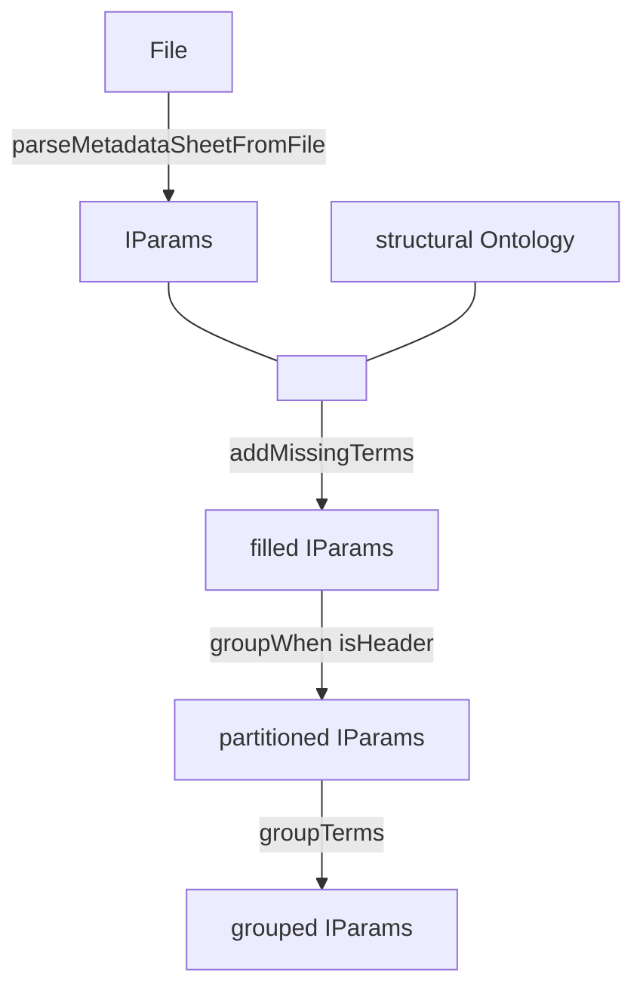

```mermaid

flowchart
	fips["filled IParams"]
	partiparams["partitioned IParams"]
	grips["grouped IParams"]
	onto["structural Ontology"]

	File -->|parseMetadataSheetFromFile| IParams
	IParams --- D[ ]:::empty
	onto --- D
	D -->|addMissingTerms| fips
	fips -->|"groupWhen isHeader"| partiparams
	partiparams -->|groupTerms| grips


```