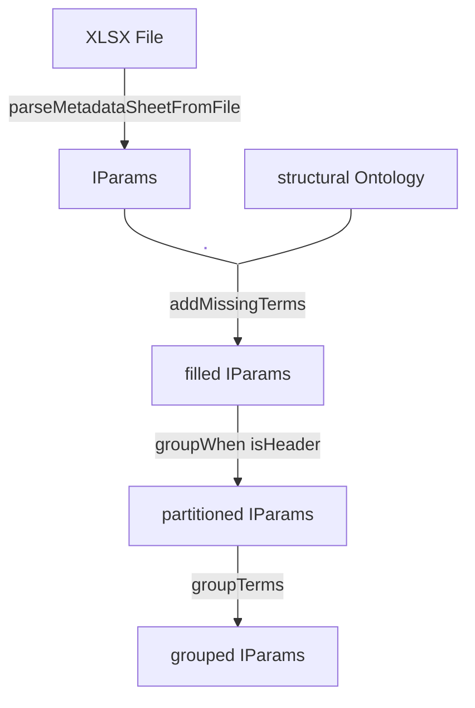

```mermaid

flowchart 
	xf[XLSX File]
	fips[filled IParams]
	partiparams[partitioned IParams]
	grips[grouped IParams]
	onto[structural Ontology]
	D[ ]:::empty

	style D width:1
	style D height:1
	classDef empty width:0px,height:0px;

	xf -->|parseMetadataSheetFromFile| IParams
	IParams & onto --- D
	D -->|addMissingTerms| fips
	fips -->|groupWhen isHeader| partiparams
	partiparams -->|groupTerms| grips


```